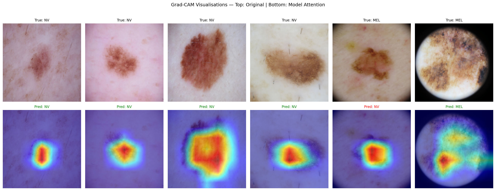
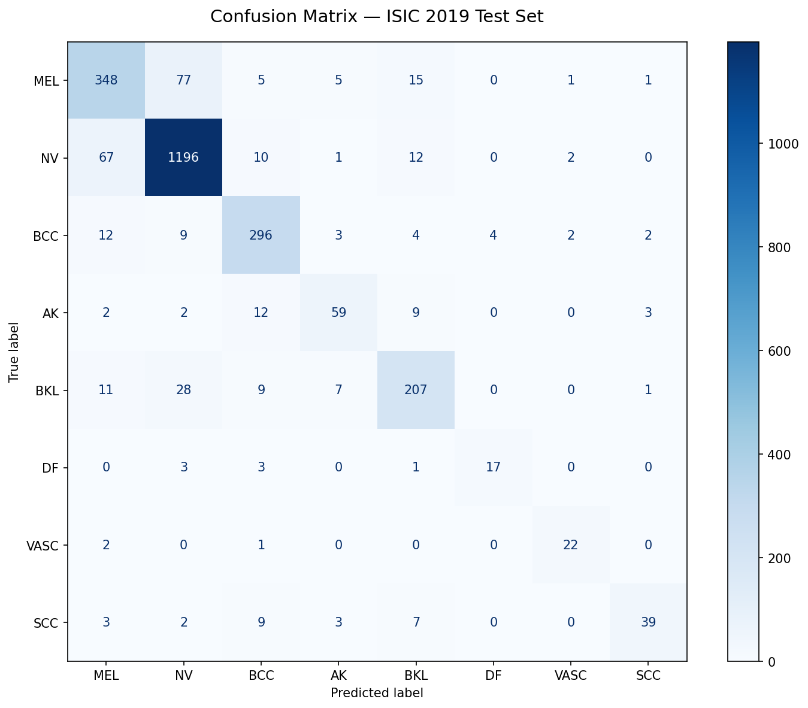

# dl-01-cnn-skin-lesion

Skin lesion classification using ResNet-50 and Grad-CAM interpretability.
Part of a deep learning architecture exploration series.

## Results

| Metric              | Score  |
|---------------------|--------|
| Test Accuracy       | 86.2%  |
| Melanoma Recall     | 77.0%  |
| Macro F1            | 0.800  |
| Weighted F1         | 0.861  |

Training metrics tracked on Weights & Biases:
[View Dashboard](https://wandb.ai/thiliniiw-uofsc/skin-lesion-cnn)

## Grad-CAM — Model Interpretability

Grad-CAM visualisations confirm the model attends to the lesion
itself rather than background artefacts or image metadata.



## Confusion Matrix



## Dataset

[ISIC 2019](https://challenge.isic-archive.com/data/#2019) —
25,331 dermoscopic images across 8 diagnostic categories.

| Class | Name                    | Train  |
|-------|-------------------------|--------|
| MEL   | Melanoma                | 4,522  |
| NV    | Melanocytic nevus       | 12,875 |
| BCC   | Basal cell carcinoma    | 3,323  |
| AK    | Actinic keratosis       |   867  |
| BKL   | Benign keratosis        | 2,624  |
| DF    | Dermatofibroma          |   239  |
| VASC  | Vascular lesion         |   253  |
| SCC   | Squamous cell carcinoma |   628  |

## Pipeline

data/
download.sh              # ISIC 2019 download instructions
configs/
config.yaml              # all hyperparameters
src/
dataset.py               # data loading, augmentation, balanced sampling
model.py                 # ResNet-50 with transfer learning
train.py                 # training loop, early stopping, wandb logging
evaluate.py              # metrics, confusion matrix, Grad-CAM
utils.py                 # shared helpers
tests/                     # 25 unit tests
outputs/
figures/                 # confusion matrix and Grad-CAM visualisations

## Architecture

- **Backbone:** ResNet-50 pretrained on ImageNet
- **Head:** Dropout(0.4) + Linear(2048 → 8)
- **Loss:** CrossEntropyLoss
- **Optimiser:** AdamW (lr=0.0001, weight_decay=0.00001)
- **Scheduler:** CosineAnnealingLR over 30 epochs
- **Sampler:** WeightedRandomSampler to handle class imbalance

## Setup

```bash
# Create environment
conda create -n dl-01-cnn-skin-lesion python=3.11
conda activate dl-01-cnn-skin-lesion

# Install PyTorch (Apple Silicon)
conda install pytorch torchvision torchaudio -c pytorch

# Install dependencies
pip install -r requirements.txt
```

## Training

```bash
python -m src.train --config configs/config.yaml
```

## Evaluation

```bash
python -m src.evaluate --config configs/config.yaml
```

## Testing

```bash
pytest tests/ -v
```

## Key Findings

- **Grad-CAM** confirms the model attends to dermoscopic features
  of the lesion rather than background artefacts or rulers
- **SCC recall (62%)** is the weakest class — confusion matrix shows
  SCC being confused with BCC, consistent with their visual similarity
- **WeightedRandomSampler** was critical — without it the model
  would collapse to predicting NV (~50% accuracy) on a dataset
  where NV has 54x more samples than DF